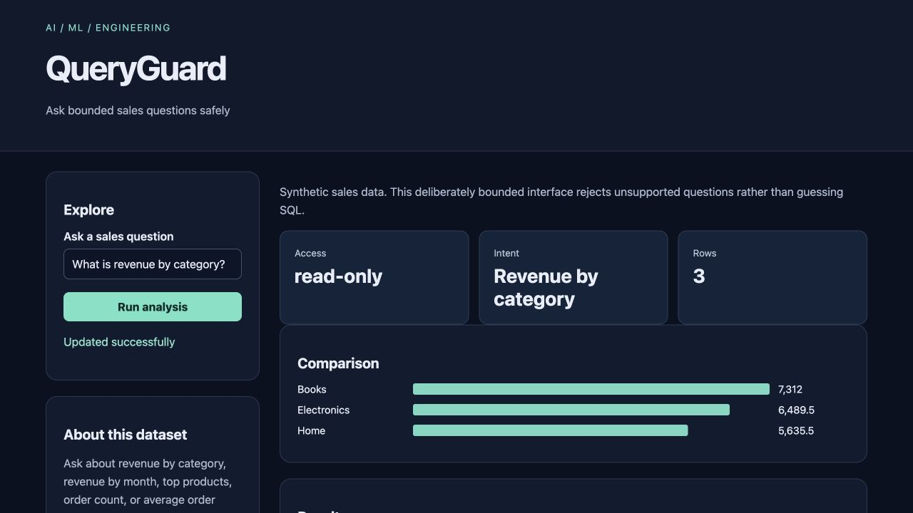

# QueryGuard

Ask bounded sales questions safely for **business analysts**.

Original topic: **Text-to-SQL Interface** from [the source post](https://www.instagram.com/p/DdyMaogE4ud/).

> Local portfolio implementation developed with Codex assistance. Measured results and limitations are documented; no production adoption, revenue or hiring outcome is claimed.



## What works

- Five supported natural-language business intents
- Parameterized SQL and visible execution plans
- SQLite read-only access, authorizer and query budgets

[Example output](reports/example-output.json) · [Recorded checks](reports/test-results.txt) · [Learning and interview guide](LEARNING_GUIDE.md)

## Start

Python 3.12 is the validated Python runtime. Run commands from this repository directory. Windows users activate `.venv\Scripts\activate` instead of `source`.

```sh
python3.12 -m venv .venv
source .venv/bin/activate
python -m pip install -r requirements.txt
python app.py
```

Open **http://127.0.0.1:8080**. Keep the process running. Set `PORT` to use another port. The Python development servers are intended for local demonstrations.

## Demonstration

Ask for revenue by category, monthly revenue, top 3 products and order count. Inspect the actual SQL and parameters. Try a write statement and observe rejection by both planner tests and database authorizer tests.

## Architecture and decisions

Browser controls → validated Flask API → project analysis/workflow → results and export.

Stack: SQLite · Flask.

1. Map supported natural-language intents to fixed query templates with bound parameters.
2. Enforce read-only access through SQLite URI mode, an authorizer allowlist, and a VM instruction budget.
3. Reject unsupported questions instead of generating arbitrary SQL that only looks plausible.

## Verification

```sh
python -m pytest -q
```

See [VERIFICATION.md](VERIFICATION.md) for actual executed checks, setup verification, model/data results and any outstanding environment limitations. The [recorded CI runs](reports/ci-verification.json) passed for the linked source revision.

## Data and attribution

Synthetic sales database. See [DATA_AND_SOURCES.md](DATA_AND_SOURCES.md) for provenance and usage notes. Original project code is MIT unless a preserved source file or dependency states otherwise. Model and third-party data licenses remain separate.

## Limitations and next improvement

A constrained natural-language parser, not a generative text-to-SQL model. It supports five documented business intents on a synthetic table. No joins, arbitrary schemas, multi-tenant permissions or semantic clarification dialogue.

Suggested extension: Add one parameterized date-range intent and test its boundaries and read-only execution.

## Honest portfolio use

This implementation and documentation were developed with substantial Codex assistance. Before presenting it, run the demonstration, explain the design choices, and complete the suggested independent modification. Do not describe generated code as work experience, an accepted upstream contribution, or a deployed production service.
